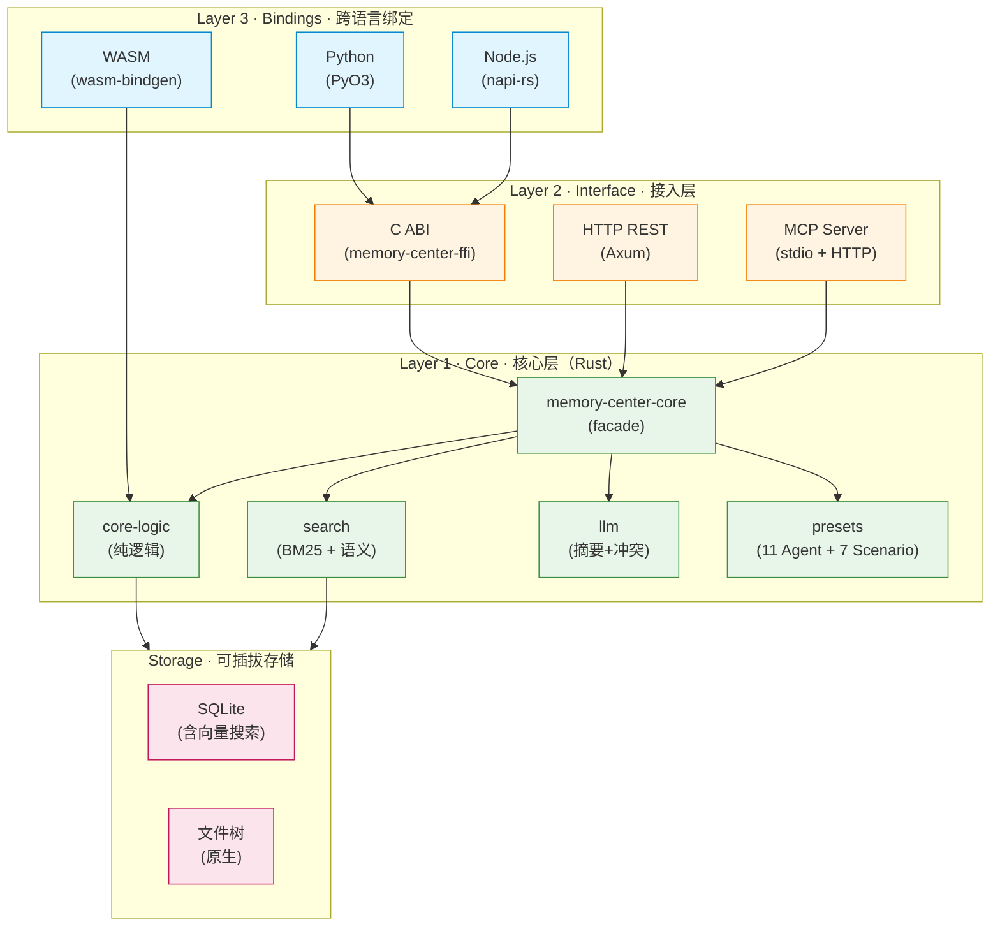
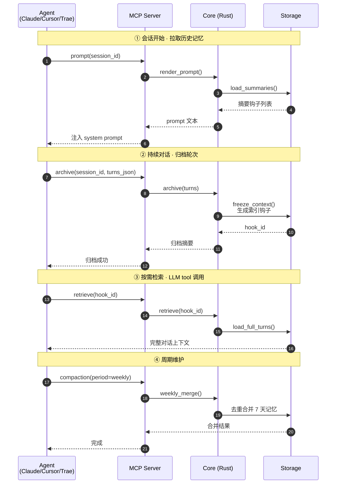
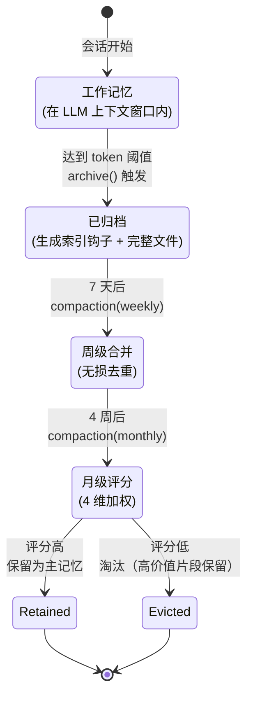

# MemoryCenter

> Agent 记忆库依赖库 —— 跨语言可引用的持久化高效完整记忆系统

[](LICENSE)
[](https://www.rust-lang.org)
[](#crate-矩阵)
[](#测试)
[](#6-mcp-server-v237推荐用于-claude-code--cursor--trae--codex-cli)
[](#接口概览)
<br/>
[](https://github.com/LINGTIAN303/MemoryCenter/actions/workflows/ci.yml)
[](https://github.com/LINGTIAN303/MemoryCenter/stargazers)
[](https://github.com/LINGTIAN303/MemoryCenter/network/members)
[](https://github.com/LINGTIAN303/MemoryCenter/issues)
[](https://github.com/LINGTIAN303/MemoryCenter/commits/main)

> [!NOTE]
> **TRAE AI 创造力大赛参赛项目** · 学习工作赛道
>
> 本仓库为开发中状态，创意提案以 `contest/creative-proposal.html`（报名帖附件）为准。HTML 内的评测数据、能力指标、迭代路线均为**预期目标**，非已交付状态。
>
> 代码仓库将在初赛阶段公开，报名期间暂不接受外部协作。

## 目录

- [定位](#定位agent-的时序记忆基础设施)
- [核心特性](#核心特性)
- [架构分层](#架构分层)（含 Mermaid 架构图）
- [Crate 矩阵](#crate-矩阵)
- [文档](#文档)
- [快速开始](#快速开始)
- [接口概览](#接口概览)
- [核心概念](#核心概念)（含 Mermaid 时序图 + 状态机）
- [工作流](#工作流典型-agent-接入)
- [技术栈](#技术栈)
- [测试](#测试)
- [项目状态](#项目状态)
- [License](#license)

## 命名寓意

作为 Agent 的记忆中心（Memory Center），负责对话上下文的持久化归档与时序管理。灵感来源于大脑记忆系统的分级巩固机制——短期记忆（工作记忆）→ 长期记忆（巩固存储）→ 遗忘淘汰（评分淘汰），本项目将「天/周/月」三级索引周期映射到工程实现，为 Agent 提供生物学节律般的记忆机制。

<details>
<summary>⚠️ <b>破坏性变更通知（2026-07-04）</b> —— 点击展开迁移指南</summary>

型号库已更新至 2026 年 7 月最新官方版本。**7 个旧型号构造器被删除**，已使用旧型号的代码需迁移至新型号。详见 [CHANGELOG.md](CHANGELOG.md#型号库更新2026-07-04-核查官方文档)。

快速迁移：

- `claude_opus_4_5()` → `claude_opus_4_8()`（推荐）
- `claude_sonnet_4_5()` → `claude_sonnet_5()`
- `gemini_3_pro()` → `gemini_3_1_pro()`
- `deepseek_v3_2()` / `deepseek_r1()` → `deepseek_v4_pro()` 或 `deepseek_v4_flash()`
- `qwen_3()` → `qwen_3_coder()`
- `llama_4()` → `llama_4_scout()` 或 `llama_4_maverick()`

**紧急**：DeepSeek V3/V3.2 将于 2026-07-24 停服，请尽快迁移至 V4。

</details>

## 定位：Agent 的时序记忆基础设施

**向量库做语义检索（找"像什么"），MemoryCenter 做时序归档（找"之前发生过什么"）——两者互补不替代。**

MemoryCenter 不存向量、不做语义检索、不做 Agent 编排，专注一件事：**完整保存对话上下文（非摘要），通过三级周期管理记忆生命周期**。这是市场上的空白生态位——所有时序能力强的方案（Zep/Letta）部署都重，所有部署极简的（agentmemory/LlamaIndex）时序治理都不深。MemoryCenter 是唯一同时占据"强时序 + 极简部署"双象限的项目。

完整竞品对标见 [docs/POSITIONING.md](docs/POSITIONING.md)。

### 四个独家护城河

1. **三级索引周期 + 4 维加权评分淘汰**——天归档/周无损去重合并/月评分淘汰，竞品要么不淘汰、要么事实级失效
2. **完整对话非摘要归档**——所有竞品都走压缩/抽取/摘要路径，MemoryCenter 无损保存可追溯
3. **Rust 单二进制 + C ABI 嵌入**——唯一可嵌入宿主进程的方案，零外部依赖
4. **17 类消息级标签**——粒度最细，支持按工具调用/思考过程/代码块等维度筛选

## 核心特性

- **完整上下文归档**（非摘要）：达到阈值时冻结完整对话上下文为记忆文件，避免信息损失
- **三级索引周期**：
  - 天级（Daily）：持续归档
  - 周级（Weekly）：无损去重合并
  - 月级（Monthly）：4 维评分淘汰（时效性 / 访问频率 / 主题相关性 / 用户显式标记）
- **混合检索机制**：摘要钩子注入 system prompt + 详细钩子 LLM 主动 tool 检索 + BM25 关键词检索 + 语义检索（含 Embedding 降级）
- **17 类细粒度标签**：索引钩子支持文本/附件/图片/视频/工具调用/思考过程等多维度标注
- **跨语言引用**：Rust 核心 + C ABI 动态库 + HTTP REST API + Python 原生绑定（PyO3） + Node.js 绑定（napi-rs） + MCP Server（stdio + Streamable HTTP） + WASM 组件
- **可插拔架构**：`Storage` / `Scorer` / `Migrator` 等 trait 均可替换实现
- **冲突检测**：用户陈述与记忆矛盾时自动检测（自我矛盾 / 直接矛盾 / 立场反转三维度）
- **压缩前完整归档**：`pre_compress_hook` 在客户端压缩上下文前一次性归档完整 raw_context，避免信息丢失
- **project_memory 反向写入**：通过 `update_project_memory` 工具将 MemoryCenter 记忆主动写入 IDE 的 project_memory.md，影响下次会话的注入上下文
- **Agent 自识别**：内置 11 个 Agent 预设（Claude Code / Cursor / Trae / Codex 等），自动识别客户端并注入对应使用协议
- **场景自适应**：10 个内置 Scenario（coding / writing / research / agentcollaboration / knowledgebase / longproject 等），根据场景调整归档阈值和检索策略

## 架构分层

```
Layer 3: Bindings       ① Python 原生绑定 (PyO3, v2.2 ✅)  ② WASM 组件 (v2.35 ✅)  ③ Node/Go/Java (v2.4+)
Layer 2: Interface      ① C ABI 动态库 (MVP ✅)  ② Axum HTTP REST (v2.1 ✅)  ③ MCP Server stdio (v2.3 ✅)  ④ MCP Streamable HTTP (v2.36 ✅)
Layer 1: Core (Rust)    纯逻辑 crate（core-logic），无 IO 依赖；facade crate（core）整合原生实现
```



详细架构与数据流见 [docs/ARCHITECTURE.md](docs/ARCHITECTURE.md)。

## Crate 矩阵

| Crate | 说明 | 状态 |
|-------|------|------|
| `memory-center-core-logic` | 纯逻辑核心（数据模型 / 归档 / 索引 / 检索 / 评分 / BM25 / 语义检索），可编译为 WASM | ✅ v2.35 |
| `memory-center-core` | Facade crate，重导出 core-logic + 保留原生 IO 实现（SQLite / 文件树存储） | ✅ MVP |
| `memory-center-ffi` | C ABI 动态库 + C 头文件 | ✅ MVP |
| `memory-center-server` | Axum HTTP REST API + MCP Streamable HTTP 服务（无状态，水平扩展） | ✅ v2.36 |
| `memory-center-python` | Python 原生绑定（PyO3 + maturin） | ✅ v2.2 |
| `memory-center-mcp` | MCP Server（stdio + Streamable HTTP，21 个 tools） | ✅ v2.37 |
| `memory-center-wasm` | WASM 组件（wasm-bindgen + MemoryStorage + JsStorage） | ✅ v2.35 |
| `memory-center-models` | 型号库（11 个 Agent + 10 个 Scenario + ModelVariant 注册表） | ✅ v2.3 |
| `memory-center-presets` | 预设配置（CombinedProfile 构建 + 场景检测 + Agent 联动） | ✅ v2.3 |
| `memory-center-agents` | Agent 预设管理（ClaudeCode / Cursor / Trae / Codex 等 11 个） | ✅ v2.3 |
| `memory-center-scenarios` | 场景管理（coding / writing / research 等 10 个 + 优先级标签） | ✅ v2.3 |
| `memory-center-llm` | LLM 集成（摘要生成 + 冲突检测 + Embedding + 场景检测） | ✅ v2.3 |
| `memory-center-search` | 搜索引擎（BM25 + 语义检索 + session 级搜索） | ✅ v2.3 |
| `memory-center-skills` | 技能管理（内置技能 + 记忆链接 + 技能画像） | ✅ v2.3 |
| `memory-center-windows` | 窗口管理（上下文窗口配置 + 压缩协作策略） | ✅ v2.3 |
| `memory-center-bench` | 性能基准（核心操作 + 后端对比 + 格式对比 + 并发压测） | ✅ MVP |
| `memory-center-node` | Node.js 绑定（napi-rs 3.x，异步 Promise API） | ✅ v2.14 |
| `memory-center-go` | Go 绑定（cgo，v2.4+） | 🚧 计划中 |
| `memory-center-java` | Java 绑定（JNA，v2.4+） | 🚧 计划中 |
| `memory-center-sidecar` | OpenCode/Agent 旁路守护进程（compaction 监听 + tokens 阈值主动清空） | ✅ v2.47 |
| `memory-center-adapter` | AgentAdapter trait 抽象层（多 Agent 适配根基，解耦 sidecar 与具体 Agent） | ✅ v2.46 |
| `memory-center-dashboard` | mc-dashboard CLI（ratatui TUI，4 Tab：概览 / 记忆列表 / 检索 demo / 评测对比） | ✅ v2.37 |

## 文档

完整文档位于 [GitHub Wiki](https://github.com/LINGTIAN303/MemoryCenter/wiki)：

| 文档 | 说明 |
|------|------|
| [Getting Started](https://github.com/LINGTIAN303/MemoryCenter/wiki/Getting-Started) | 快速上手试用 |
| [Architecture](https://github.com/LINGTIAN303/MemoryCenter/wiki/Architecture) | 整体架构设计 |
| [Crate Guide](https://github.com/LINGTIAN303/MemoryCenter/wiki/Crate-Guide) | 各 Crate 选择指南 |
| [MCP Integration](https://github.com/LINGTIAN303/MemoryCenter/wiki/MCP-Integration) | MCP 接入概览与 21 个工具列表 |
| [MCP Configuration Guide](https://github.com/LINGTIAN303/MemoryCenter/wiki/MCP-Configuration-Guide) | MCP 各环境详细配置 + 踩坑排查 |
| [API Reference](https://github.com/LINGTIAN303/MemoryCenter/wiki/API-Reference) | REST API 文档 |
| [Deployment](https://github.com/LINGTIAN303/MemoryCenter/wiki/Deployment) | 生产环境部署 |
| [Changelog](https://github.com/LINGTIAN303/MemoryCenter/wiki/Changelog) | 版本变更历史 |

## 快速开始

### 1. 构建

```bash
# 克隆仓库
git clone https://github.com/lingtian303/MemoryCenter.git
cd MemoryCenter

# 构建动态库（memory_center.dll / libmemory_center.so / libmemory_center.dylib）
cargo build --release -p memory-center-ffi

# 构建产物位于：
#   Windows: target/release/memory_center.dll
#   Linux:   target/release/libmemory_center.so
#   macOS:   target/release/libmemory_center.dylib
```

### 2. C 调用示例

将 `crates/memory-center-ffi/include/memory_center.h` 与动态库一起接入项目。

<details>
<summary>点击展开 C 完整示例代码</summary>

```c
#include "memory_center.h"
#include <stdio.h>

int main(void) {
    /* 1. 创建句柄（绑定一个会话） */
    MemoryCenterHandle* h = memory_center_new(
        "./mem_data",       /* 存储根目录 */
        "session-001",      /* 会话 ID */
        NULL                /* project_id，NULL 表示无项目隔离 */
    );
    if (!h) { return 1; }

    /* 2. 归档一批轮次（turns_json 为 MessageTurn 数组的 JSON） */
    const char* turns_json = /* ... */;
    MemoryCenterResult* r = memory_center_archive(h, turns_json);
    if (memory_center_is_ok(r)) {
        char* data = memory_center_get_data(r);
        printf("归档成功，摘要：%s\n", data);
        memory_center_free_string(data);
    } else {
        char* err = memory_center_get_error(r);
        printf("归档失败：%s\n", err);
        memory_center_free_string(err);
    }
    memory_center_result_free(r);

    /* 3. 渲染 system prompt（注入到下一轮 LLM 调用） */
    MemoryCenterResult* pr = memory_center_render_prompt(h);
    if (memory_center_is_ok(pr)) {
        char* prompt = memory_center_get_data(pr);
        /* 将 prompt 拼接到 LLM system prompt 末尾 */
        memory_center_free_string(prompt);
    }
    memory_center_result_free(pr);

    /* 4. 释放句柄 */
    memory_center_free(h);
    return 0;
}
```

</details>

完整示例代码见 [examples/c/demo.c](examples/c/demo.c)。

### 3. Python 通过 ctypes 调用

```python
import ctypes, json

lib = ctypes.CDLL("./libmemory_center.so")  # Windows 用 memory_center.dll

# 配置函数签名
lib.memory_center_new.restype = ctypes.c_void_p
lib.memory_center_new.argtypes = [ctypes.c_char_p, ctypes.c_char_p, ctypes.c_char_p]
lib.memory_center_archive.restype = ctypes.c_void_p
lib.memory_center_archive.argtypes = [ctypes.c_void_p, ctypes.c_char_p]

# 创建句柄并归档
handle = lib.memory_center_new(b"./mem_data", b"session-001", None)
turns = [{"id": "...", "user_message": {...}, "llm_message": {...}, ...}]
result = lib.memory_center_archive(handle, json.dumps(turns).encode())
```

完整 Python 示例见 [examples/python/demo.py](examples/python/demo.py)。

### 4. Python 原生绑定（推荐，v2.2）

使用 PyO3 原生绑定，无需 ctypes 手动配置函数签名，支持上下文管理器自动释放。

<details>
<summary>点击展开安装与使用示例</summary>

```bash
# 安装 maturin（PyO3 团队开发的构建工具）
pip install maturin

# 构建并安装到当前 Python 环境
cd crates/memory-center-python
maturin develop --release
```

```python
from memory_center_python import MemoryCenter

# 上下文管理器自动释放资源
with MemoryCenter("./mem_data", "session-001", project_id="proj-a") as hp:
    # 1. 归档（turns 为 dict 列表，结构同 MessageTurn）
    summary = hp.archive([
        {
            "user_message": {"text": "你好", "attachments": [], "tool_calls": [], "thinking": None},
            "llm_message": {"text": "你好！有什么可以帮你？", "attachments": [], "tool_calls": [], "thinking": None},
            "tags": [{"kind": "Text"}],
            "token_count": 20,
        }
    ])
    print(f"归档成功，hook_id={summary['hook_id']}")

    # 2. 获取所有周期摘要（注入 system prompt 用）
    summaries = hp.summaries()
    print(f"共 {len(summaries)} 条记忆")

    # 3. 渲染 system prompt 文本（直接拼接给 LLM）
    prompt = hp.prompt()
    if prompt:
        print(prompt)  # 可用记忆索引 ...

    # 4. 按钩子 ID 检索完整记忆（LLM tool 调用入口）
    memory = hp.retrieve(summary["hook_id"])
    print(f"检索到 {len(memory['turns'])} 轮对话")

    # 5. 周期任务
    hp.compaction("weekly")   # 周级无损去重合并
    hp.compaction("monthly")  # 月级评分淘汰
```

</details>

详细 API 见 [crates/memory-center-python/src/lib.rs](crates/memory-center-python/src/lib.rs)。
Python 集成测试见 [crates/memory-center-python/tests/test_memory-center.py](crates/memory-center-python/tests/test_memory-center.py)（20 个 pytest 用例）。

### 5. HTTP REST API（v2.1）

启动 Axum 服务（适合远程访问 / 多语言客户端共用）：

```bash
# 启动服务（默认 127.0.0.1:8765）
MEMORY_CENTER_HOST=0.0.0.0 MEMORY_CENTER_PORT=8765 MEMORY_CENTER_ROOT=./data cargo run -p memory-center-server
```

```bash
# 归档
curl -X POST http://localhost:8765/api/v1/sessions/sess-001/archive \
  -H "Content-Type: application/json" \
  -d '{"turns": [...], "project_id": "proj-a"}'

# 获取摘要
curl http://localhost:8765/api/v1/sessions/sess-001/summaries

# 渲染 prompt
curl http://localhost:8765/api/v1/sessions/sess-001/prompt

# 检索记忆
curl http://localhost:8765/api/v1/sessions/sess-001/memories/<hook_id>

# 周期任务
curl -X POST http://localhost:8765/api/v1/sessions/sess-001/compaction \
  -H "Content-Type: application/json" -d '{"period": "weekly"}'
```

详细 HTTP API 见 [crates/memory-center-server/src/handlers.rs](crates/memory-center-server/src/handlers.rs)。

### 6. MCP Server（v2.37，推荐用于 Claude Code / Cursor / Trae / Codex CLI）

MCP（Model Context Protocol）是 Anthropic 推出的 Agent 工具调用协议，主流 AI 编程客户端全支持。MemoryCenter MCP server 让 Agent 通过标准协议调用记忆库能力，无需自己实现归档/检索逻辑。

支持两种传输模式：
- **stdio（v2.3）**：本地进程通信，零配置，适合单客户端使用
- **Streamable HTTP（v2.36）**：通过 `/mcp` 端点远程访问，多客户端共享，适合 Web 端 Agent 接入

```bash
# 构建 MCP server 二进制（stdio 模式）
cargo build --release -p memory-center-mcp
# 产物：target/release/memory-center-mcp

# 启动 Streamable HTTP 模式（与 REST API 共享 Axum 服务）
MEMORY_CENTER_MCP_ENABLED=true MEMORY_CENTER_ROOT=./data cargo run -p memory-center-server
```

stdio 模式配置（Claude Code / Cursor / Trae 等客户端）：

```json
{
  "mcpServers": {
    "memory-center": {
      "command": "/path/to/memory-center-mcp",
      "env": {
        "MEMORY_CENTER_ROOT": "/path/to/memory/data"
      }
    }
  }
}
```

Streamable HTTP 模式配置（DeepSeek 网页端等远程客户端）：

```json
{
  "mcpServers": {
    "memory-center": {
      "url": "https://your-server/mcp",
      "transport": "streamable-http"
    }
  }
}
```

启动后，Agent 会自动发现 21 个 tools：

| 类别 | Tools |
|------|-------|
| 归档/检索 | `archive` / `pre_compress_hook` / `retrieve` / `batch_retrieve` / `batch_delete` / `batch_update` / `find_hook_by_prefix` |
| 摘要/渲染 | `summaries` / `prompt` / `get_config` |
| 检索增强 | `semantic_search` / `detect_conflicts` / `get_conflicts` |
| 周期任务 | `compaction` |
| 预设管理 | `preset_build` / `preset_list_agents` / `preset_list_scenarios` / `preset_list_models` |
| 项目记忆 | `update_project_memory` / `get_project_memory` |
| 规则安装 | `install_rules`（支持本地直接写入 + 远程模板模式） |

详细 MCP tools 实现见 [crates/memory-center-mcp/src/lib.rs](crates/memory-center-mcp/src/lib.rs)。
MCP 集成测试见 [crates/memory-center-mcp/tests/](crates/memory-center-mcp/tests/)（56 个测试用例）。

## 接口概览

四种接口形态对应同一组核心操作（archive / retrieve / summaries / prompt / compaction）：

| 操作 | C ABI | HTTP REST | Python 原生 | MCP Server |
|------|-------|-----------|-------------|------------|
| 创建句柄 | `memory_center_new(root, sid, pid)` | （URL path 含 sid） | `MemoryCenter(root, sid, project_id=...)` | （每次 tool 调用传 sid） |
| 归档 | `memory_center_archive(h, turns_json)` | `POST /archive` | `hp.archive(turns)` | `archive` tool（params: sid/turns_json/project_id） |
| 检索 | `memory_center_retrieve(h, hook_id)` | `GET /memories/{hook_id}` | `hp.retrieve(hook_id)` | `retrieve` tool（params: sid/hook_id/project_id） |
| 摘要 | `memory_center_get_summaries(h)` | `GET /summaries` | `hp.summaries()` | `summaries` tool（params: sid/project_id） |
| Prompt | `memory_center_render_prompt(h)` | `GET /prompt` | `hp.prompt()` | `prompt` tool（params: sid/project_id） |
| 周期任务 | `memory_center_run_compaction(h, 0/1)` | `POST /compaction` | `hp.compaction("weekly"/"monthly")` | `compaction` tool（params: sid/period/project_id） |
| 释放 | `memory_center_free(h)` | （无状态） | `with` 上下文管理器 / `hp.close()` | （无状态） |

**线程安全**：FFI 的 `MemoryCenterHandle` 不保证线程安全（建议每线程独立 handle）。HTTP 服务无状态，天然支持并发。Python 绑定受 GIL 约束，单实例串行调用。MCP server 每次 tool 调用独立 Storage，无共享状态。

完整接口定义：
- C ABI: [crates/memory-center-ffi/include/memory_center.h](crates/memory-center-ffi/include/memory_center.h)
- HTTP: [crates/memory-center-server/src/handlers.rs](crates/memory-center-server/src/handlers.rs)
- Python: [crates/memory-center-python/src/lib.rs](crates/memory-center-python/src/lib.rs)
- MCP: [crates/memory-center-mcp/src/lib.rs](crates/memory-center-mcp/src/lib.rs)

## 核心概念

### Agent 调用流程（MCP 时序图）



### 记忆生命周期（状态机）



### 归档（Archive / Freeze）

达到 token 阈值时，将完整上下文（用户消息 + LLM 消息）冻结为记忆文件，**非摘要**。

- **软阈值**：达到 `token_threshold`（如 400K）后，若当前轮次未完成则等待
- **硬上限**：达到 1.5 倍阈值（如 600K）强制截断，标记 `truncated=true`

### 索引钩子（Index Hook）

指向记忆文件的指针，带 17 类细粒度标签。分层设计：

- **摘要钩子**：注入 system prompt，包含标题+标签+时间戳（轻量）
- **详细钩子**：通过 tool 调用按需检索（含完整信息）

### 三级周期

| 周期 | 操作 | 说明 |
|------|------|------|
| 天级（Daily） | 持续归档 | 会话窗口达阈值 → 冻结为记忆文件 → 生成索引钩子 → 从 LLM 上下文丢弃 |
| 周级（Weekly） | 无损去重合并 | 7 天内的记忆文件去重 + 原样合并为 1 个，索引同步合并 |
| 月级（Monthly） | 评分淘汰 | 4 个周记忆文件按 4 维加权评分，选最高分为主记忆，其余高价值片段保留 |

### 17 类标签

文本消息 / 文件附件 / 图片 / 视频 / 工具调用 / 思考过程 / 会话 ID / 项目 ID / URL / 引用 / 状态 / UI / 代码块 / 语音 / 计划 / 使用的 Agent 工具 / 其他（`Other(String)` 兜底扩展）

## 工作流（典型 Agent 接入）

```
┌─────────────────────────────────────────────────────────────┐
│ 1. Agent 会话开始                                            │
│    - 调用 memory_center_new() 创建 handle（绑定 session_id）    │
│    - 调用 memory_center_render_prompt() 获取历史记忆摘要        │
│    - 将摘要拼接到 system prompt 末尾                          │
├─────────────────────────────────────────────────────────────┤
│ 2. Agent 持续对话                                             │
│    - 每轮结束后调用 memory_center_archive() 归档（携带 turns）   │
│    - 当 LLM 需要历史细节时，通过 tool 调用 retrieve_memory   │
├─────────────────────────────────────────────────────────────┤
│ 3. 周期维护（按需触发）                                       │
│    - 每周：memory_center_run_compaction(WEEKLY) 去重合并        │
│    - 每月：memory_center_run_compaction(MONTHLY) 评分淘汰      │
├─────────────────────────────────────────────────────────────┤
│ 4. 会话结束                                                  │
│    - 调用 memory_center_free() 释放 handle                     │
└─────────────────────────────────────────────────────────────┘
```

## 技术栈

- Rust 1.85+（edition 2021，rmcp 1.8 要求 edition 2024 编译器）
- 序列化：JSON（MVP 可调试优先，v2 支持 MessagePack）
- 存储：可插拔 trait，默认本地文件树 + SQLite（含向量搜索）
- 异步运行时：tokio（FFI/Python/MCP 内部 `current_thread` runtime，HTTP 服务 `rt-multi-thread`）
- HTTP 框架：Axum 0.8 + tower-http 0.7
- Python 绑定：PyO3 0.29 + maturin（cdylib）
- MCP 协议：rmcp 1.8（stdio + Streamable HTTP 双传输）
- WASM：wasm-bindgen + serde-wasm-bindgen + js-sys（条件编译 wasm32 target）
- 搜索：BM25 关键词检索 + 语义检索（Embedding API，含降级为纯 BM25）
- 分词：jieba-rs（native）/ 简易字符分词（wasm）

## 测试

```bash
# Rust 全部测试（单元 + 集成 + FFI + HTTP + MCP）
cargo test --workspace

# Clippy 检查
cargo clippy --workspace --all-targets -- -D warnings

# 性能基准（见 docs/BENCHMARKS.md）
cargo bench -p memory-center-core

# Python 集成测试（需先 maturin develop 安装）
cd crates/memory-center-python
pip install maturin pytest
maturin develop --release
pytest tests/test_memory_center.py -v
```

当前测试覆盖（v2.37）：56 MCP + 41 HTTP Server + 51 core-logic 单元 + 17 FFI + 20 Python + bench/集成 = **185+ 测试全部通过**，clippy 0 警告。

## 项目状态

- ✅ **MVP（P0-P5）**：核心库 + C ABI 动态库 + 文档 + 示例 + 跨语言测试 + 性能基准
- ✅ **v2.1**：HTTP/Axum REST API 服务（无状态，水平扩展）
- ✅ **v2.2**：Python 原生绑定（PyO3 + maturin，OOP 风格 + 上下文管理器）
- ✅ **v2.3**：MCP Server（rmcp，stdio 传输）+ 预设系统（11 Agent + 7 Scenario）+ 差异化定位文档
- ✅ **v2.3x**：冲突检测 + 压缩前归档（pre_compress_hook）+ 语义检索 + project_memory 反向写入 + install_rules 规则安装
- ✅ **v2.35**：WASM 组件（wasm-bindgen + MemoryStorage + JsStorage + MemoryCenterCore JS API）
- ✅ **v2.36**：MCP Streamable HTTP 传输（`/mcp` 端点，与 REST API 共享 Axum 服务）
- ✅ **v2.37**：install_rules 远程模式（HTTPS MCP 模式下返回模板让 LLM 用 Write 工具创建文件）
- 🚧 **v2.4 路线图**：Go/Java 绑定 + 语义检索增强（向量库集成）

变更历史见 [CHANGELOG.md](CHANGELOG.md)。

## License

[MIT](LICENSE)
